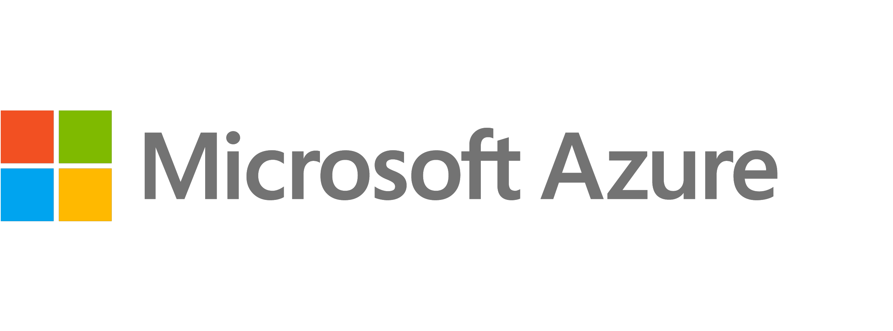
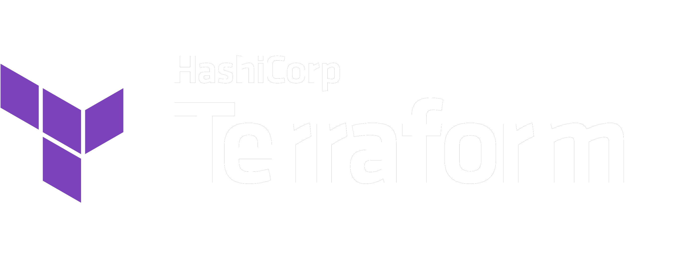

# Azure Landing Zone Terraform Accelerator

| :warning: WARNING!          |
|:---------------------------|
| This repository is a work in progress, do not use it. This notice will be removed once it is ready for pre-release. We have made this repository public to enable end to end testing only. |

<picture>
  <source media="(prefers-color-scheme: dark)" srcset="./docs/wiki/media/MS-Azure_logo_horiz_c-white_rgb.png">
  <source media="(prefers-color-scheme: light)" srcset="./docs/wiki/media/MS-Azure_logo_horiz_c-gray_rgb.png">
  
</picture>

<picture>
  <source media="(prefers-color-scheme: dark)" srcset="./docs/wiki/media/Terraform_PrimaryLogo_ColorWhite_RGB.png">
  <source media="(prefers-color-scheme: light)" srcset="./docs/wiki/media/Terraform_PrimaryLogo_Color_RGB.png">
  
</picture>

## Introduction

This repository provides an opinionated implementation of the Azure Landing Zones Terraform module, with Azure DevOps pipelines and GitHub actions workflows.

It is designed to be used as a template to enable you to get started quickly deploying ALZ with Terraform.

Please refer to our [wiki](https://github.com/Azure/alz-terraform-accelerator/wiki) for detailed usage instructions.

## Contributing

This project welcomes contributions and suggestions.  Most contributions require you to agree to a
Contributor License Agreement (CLA) declaring that you have the right to, and actually do, grant us
the rights to use your contribution. For details, visit https://cla.opensource.microsoft.com.

When you submit a pull request, a CLA bot will automatically determine whether you need to provide
a CLA and decorate the PR appropriately (e.g., status check, comment). Simply follow the instructions
provided by the bot. You will only need to do this once across all repos using our CLA.

This project has adopted the [Microsoft Open Source Code of Conduct](https://opensource.microsoft.com/codeofconduct/).
For more information see the [Code of Conduct FAQ](https://opensource.microsoft.com/codeofconduct/faq/) or
contact [opencode@microsoft.com](mailto:opencode@microsoft.com) with any additional questions or comments.

## Trademarks

This project may contain trademarks or logos for projects, products, or services. Authorized use of Microsoft
trademarks or logos is subject to and must follow
[Microsoft's Trademark & Brand Guidelines](https://www.microsoft.com/legal/intellectualproperty/trademarks/usage/general).
Use of Microsoft trademarks or logos in modified versions of this project must not cause confusion or imply Microsoft sponsorship.
Any use of third-party trademarks or logos are subject to those third-party's policies.
