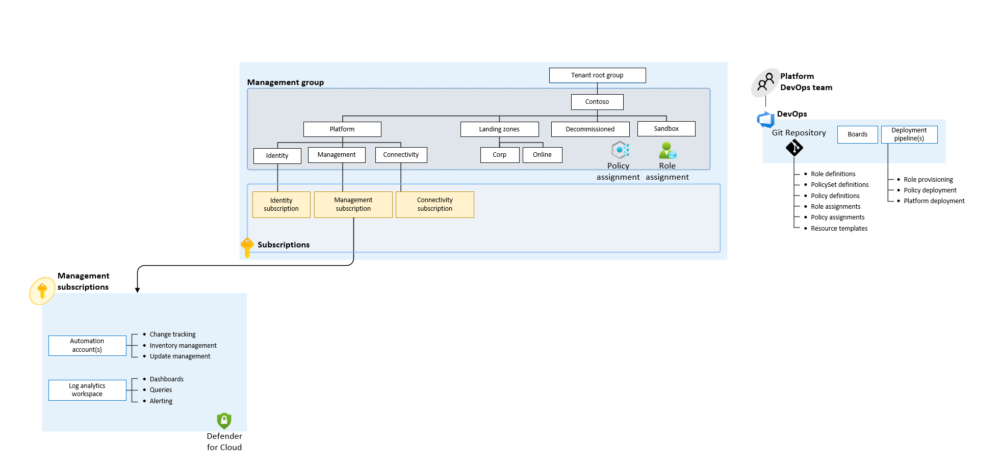

<!-- markdownlint-disable first-line-h1 -->

The `basic` starter module creates a management group hieracrhy with polciy assignments, and deploys management resources such as the log analytics workspace and automation account.

## High Level Design 

## Terraform Modules 
### `caf-enterprise-scale`
The `caf-enterprise-scale` module is solely used for this basic starter module, and has only been populated with its most basic of inputs. It is worth noting that the module itself can be extended to deploy, connectivity resources, custom polices and more. For more information on the module itself see [here](https://github.com/Azure/terraform-azurerm-caf-enterprise-scale)
## Inputs

- `default_location`: The location for Azure resources (e.g 'uksouth').
- `subscription_id_connectivity`: The identifier of the Connectivity Subscription.
- `subscription_id_identity`: The identifier of the Identity Subscription.
- `subscription_id_management`: The identifier of the Management Subscription.
- `root_id`: The root id is the identity for the root managment group and a prefix applied to all management group identities.
- `root_name`: The display name for the root management group.
