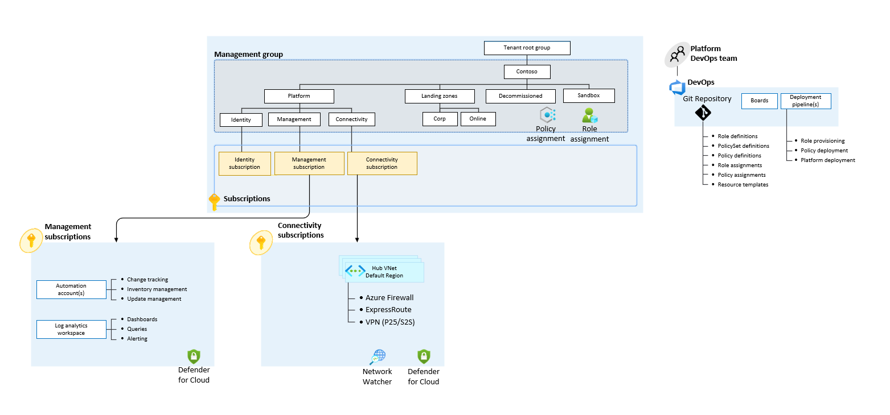

<!-- markdownlint-disable first-line-h1 -->
The `complete` starter module provides full customization of the Azure Landing Zone using the `config.yaml` file. The `config.yaml` file provides the ability to enable and disable modules, configure module inputs and outputs, and configure module resources.
A custom `config.yaml` file can be passed to the `additional_files` argument of the ALZ PowerShell Module. This allows you to firstly design your Azure Landing Zone, and then deploy it.
If not specified, the default `config.yaml` file will be used, which is as follows:
  
  ```yaml
---
archetypes: # `caf-enterprise-scale` module, add inputs as listed on the module registry where necessary.
  root_name: es
  root_id: Enterprise-Scale
  deploy_corp_landing_zones: true
  deploy_online_landing_zones: true
  default_location: uksouth
  disable_telemetry: true
  deploy_management_resources: true
  configure_management_resources:
    location: uksouth
    settings:
      security_center:
        config:
          email_security_contact: "security_contact@replace_me"
    advanced:
      asc_export_resource_group_name: rg-asc-export
      custom_settings_by_resource_type:
        azurerm_resource_group:
          management:
            name: rg-management
        azurerm_log_analytics_workspace:
          management:
            name: log-management
        azurerm_automation_account:
          management:
            name: aa-management
connectivity:
  hubnetworking: # `hubnetworking` module, add inputs as listed on the module registry where necessary.
    hub_virtual_networks:
      primary:
        name: vnet-hub
        resource_group_name: rg-connectivity
        location: uksouth
        address_space:
          - 10.0.0.0/16
        firewall:
          name: fw-hub
          sku_name: AZFW_VNet
          sku_tier: Standard
          subnet_address_prefix: 10.0.1.0/24
        virtual_network_gateway: # `vnet-gateway` module, add inputs as listed on the module registry where necessary.
          name: vgw-hub
          sku: VpnGw1
          type: Vpn
          subnet_address_prefix: 10.0.2.0/24
  ```

> **Note:** We recommend that you use the `caf-enterprise-scale` module for management groups and policies, and the `hubnetworking` module for connectivity resources. However, connectivity resources can be deployed using the `caf-enterprise-scale` module if you desire.

The schema for the `config.yaml` is documented here - [YAML Schema for `config.yaml`][wiki_yaml_schema_reference].

## High Level Design



## Terraform Modules

### `caf-enterprise-scale`

The `caf-enterprise-scale` module is used to deploy the management group hierarchy, policy assignments and management resources. For more information on the module itself see [here](https://github.com/Azure/terraform-azurerm-caf-enterprise-scale).

### `hubnetworking`

The `hubnetworking` module is used to deploy connectivity resources such as Virtual Networks and Firewalls.
This module can be extended to deploy multiple Virtual Networks at scale, Route Tables, and Resource Locks. For more information on the module itself see [here](https://github.com/Azure/terraform-azurerm-hubnetworking).

### `vnet-gateway`

The `vnet-gateway` module is used to deploy a Virtual Network Gateway inside your Virtual Network. Further configuration can be added depending on requirements to deploy Local Network Gateways, configure Virtual Network Gateway Connections, deploy ExpressRoute Gateways and more. Additional information on the module can be found [here](https://github.com/Azure/terraform-azurerm-vnet-gateway).

## Inputs

- `subscription_id_connectivity`: The identifier of the Connectivity Subscription.
- `subscription_id_identity`: The identifier of the Identity Subscription.
- `subscription_id_management`: The identifier of the Management Subscription.
- `additional_files`: Argument where our custom `config.yaml` file is passed to the module.

## Example

### Design your Azure Landing Zone through a custom `config.yaml` file

Create a custom `config.yaml` to tailor to your needs, for example an Azure Landing Zone with a three-region mesh:

```yaml

# Path of file: C:\users\johndoe\config.yaml

archetypes: # `caf-enterprise-scale` module, add inputs as listed on the module registry where necessary.
  root_name: es
  root_id: Enterprise-Scale
  deploy_corp_landing_zones: true
  deploy_online_landing_zones: true
  default_location: uksouth
  disable_telemetry: true
  deploy_management_resources: true
connectivity:
  hubnetworking: # `hubnetworking` module, add inputs as listed on the module registry where necessary.
    hub_virtual_networks:
      primary:
        name: vnet-hub-uks
        resource_group_name: rg-connectivity-uks
        location: uksouth
        mesh_peering_enabled: true
        address_space:
          - 10.0.0.0/16
      secondary: 
        name: vnet-hub-ukw
        resource_group_name: rg-connectivity-ukw
        location: ukwest
        mesh_peering_enabled: true
        address_space:
          - 10.1.0.0/16
      tertiary:
        name: vnet-hub-ne
        resource_group_name: rg-connectivity-ne
        location: northeurope
        mesh_peering_enabled: true
        address_space:
          - 10.2.0.0/16
    
```

### Use the ALZ PowerShell Module to prepare your Azure Landing Zone for deployment

Set your inputs.yaml file (See [Frequently Asked Questions][wiki_frequently_asked_questions] for more information on the `inputs.yaml` file.) for the `New-ALZEnvironment` command as follows:

```yaml
# Path of file: C:\users\johndoe\inputs.yaml

starter_module: "complete"
azure_location: "uksouth"
version_control_system_access_token: "xxxxxxxxxx"
version_control_system_organization: "contoso"
azure_location": "uksouth"
azure_subscription_id: "00000000-0000-0000-0000-000000000000"
service_name: "alz"
environment_name: "mgmt"
postfix_number: "1"
# repository_visibility: "public" # GitHub Only
azure_devops_use_organisation_legacy_url: "false" # Azure DevOps Only
azure_devops_create_project: "true" # Azure DevOps Only
azure_devops_project_name: "alz-demo" # Azure DevOps Only
azure_devops_authentication_scheme: "WorkloadIdentityFederation" # Azure DevOps Only
root_management_group_display_name: "Tenant Root Group"
additional_files: "C:\users\johndoe\config.yaml"
version_control_system_use_separate_repository_for_templates: "true"

# Starter Module Specific Variables
subscription_id_connectivity: "00000000-0000-0000-0000-000000000000"
subscription_id_identity: "00000000-0000-0000-0000-000000000000"
subscription_id_management: "00000000-0000-0000-0000-000000000000"

```

Run the accelerator:

```powershell
# Working Directory: C:\users\johndoe
New-ALZEnvironment -IaC "terraform" -Cicd "azuredevops" -Inputs "inputs.yaml" -autoApprove -alzVersion "v0.1.9"

```

 [//]: # (************************)
 [//]: # (INSERT LINK LABELS BELOW)
 [//]: # (************************)

[wiki_yaml_schema_reference]: %5BUser-Guide%5D-YAML-Schema-Reference "Wiki - YAML Schema Reference"
[wiki_frequently_asked_questions]: Frequently-Asked-Questions "Wiki - Frequently Asked Questions"
